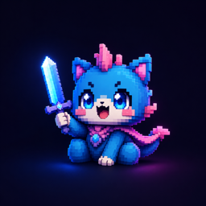
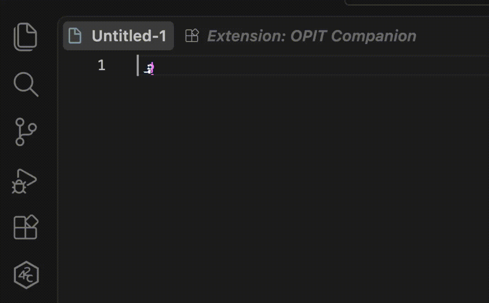
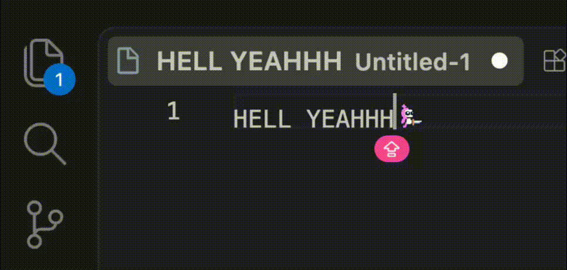
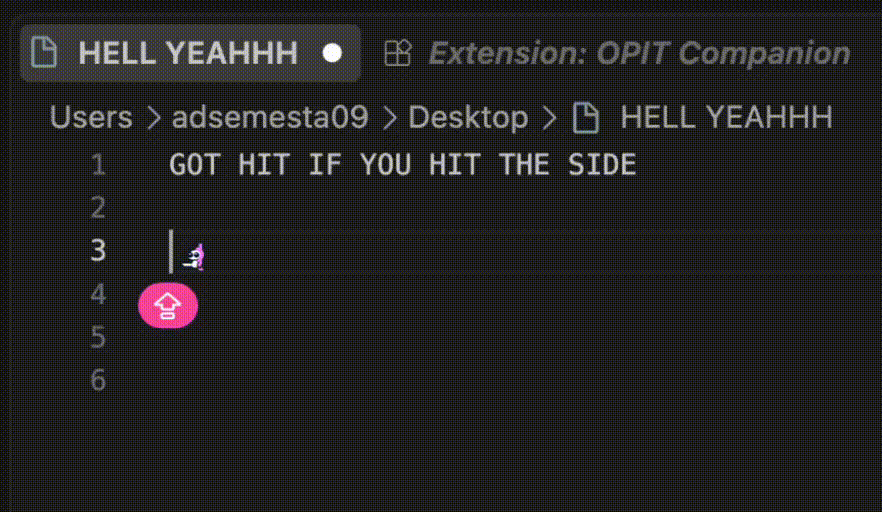
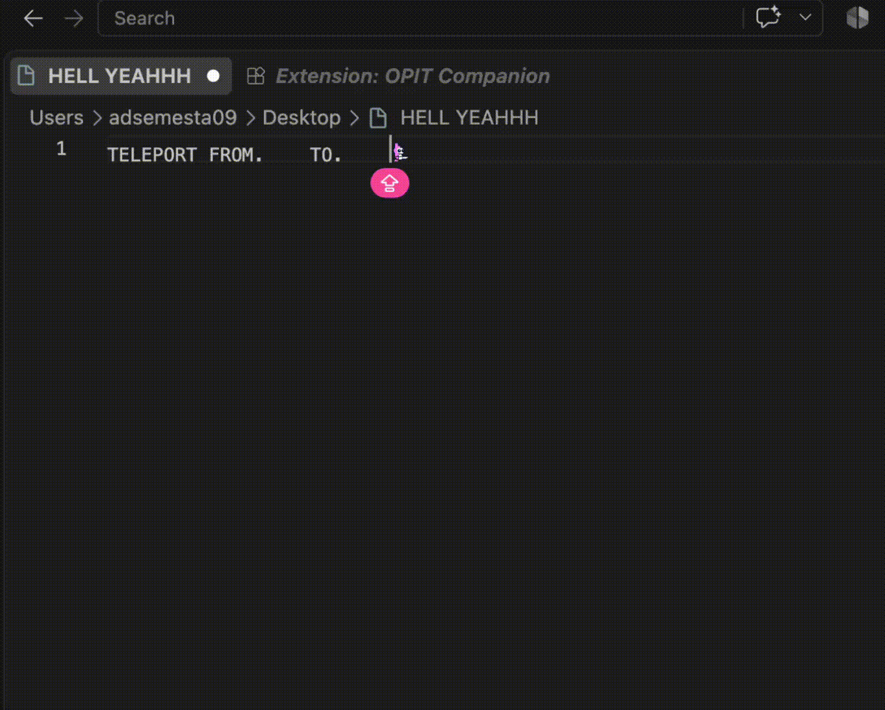
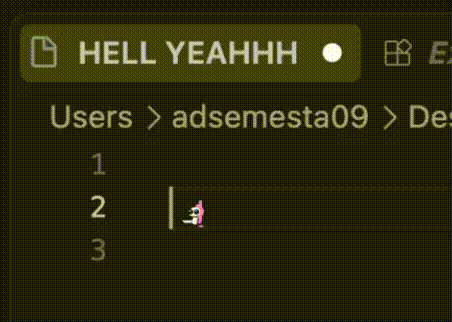

<p align="center">
  
</p>

<h1 align="center">OPIT Companion</h1>

<p align="center">
  <strong>Your Tiny Coding Companion</strong><br>
  <em>A lively, reactive pixel-art companion that lives inside your code editor, reacting dynamically to every keystroke, shortcut, and error right beside your cursor.</em>
</p>

<p align="center">
  <a href="https://marketplace.visualstudio.com/items?itemName=Taufik-H.opit-companion"></a>
  <a href="https://marketplace.visualstudio.com/items?itemName=Taufik-H.opit-companion"></a>
  <a href="https://github.com/Taufik-H/opit-companion"></a>
  <a href="https://github.com/Taufik-H/opit-companion/blob/main/LICENSE"></a>
</p>

<p align="center">
  
</p>

---

## ⚡ Quick Install

In VS Code or Cursor:
1. Press `Cmd + P` (Mac) or `Ctrl + P` (Windows/Linux).
2. Paste:
   ```bash
   ext install Taufik-H.opit-companion
   ```
3. Press **Enter**!

---

## 📖 Overview

Coding can be intense and solitary. **OPIT Companion** transforms your daily coding routine by placing an expressive, animated sprite directly into your text editor.

As you write code, OPIT stays right by your cursor—sprinting when you type fast, celebrating when you save, slashing when you delete, and reacting when errors appear. It is designed to be lightweight, fluid, and delightful without getting in the way of your productivity.

---

## ✨ Features & Action Showcase

### 🏃 1. Keystroke & Editor Reactions
OPIT actively observes your editor actions and reacts in real time with continuous physics momentum:

<p align="center">
  
</p>

| Action | OPIT Reaction | What Happens |
| :--- | :--- | :--- |
| **Typing** | 🏃 **Sprint / Dash** | Runs alongside your cursor as you type |
| **Fast Typing** | ⚡ **Speed Sprint** | Accelerates into high-speed momentum when typing rapidly |
| **Backspace / Delete** | ⚔️ **Slash Attack** | Swings weapon and slashes away deleted characters |
| **Enter / Newline** | 💥 **Jump & Drop** | Leaps into the air and lands gracefully on the new line |
| **Save (`Cmd+S` / `Ctrl+S`)** | 🎉 **Celebration** | Jumps in joy with celebratory stars when files are saved |
| **Code Errors / Linter** | 🤒 **Sick / Dizzy** | Shows a dizzy, sick reaction when syntax errors are detected |
| **Mouse Click / Jump** | 💨 **Poof Teleport** | Disappears with smoke and materializes at the clicked position |
| **Bumping Boundaries** | 🧱 **Wall Bump & Squat** | Bumps into the left wall or squats when reaching the bottom |

---

### 🎭 2. Live Character Switching
Choose from distinct hero characters, each with their own theme color, personality, and animations:

<p align="center">
  
</p>

- 🌸 **Pink Monster**: Energetic and playful companion.
- 🔷 **Blue Hero**: Sleek and focused warrior.
- 🤍 **White Chocobo**: Minimalist and calm paladin.

---

### 🎛️ 3. Sleek Control Deck & Settings
Access the companion control center from the **Activity Bar** (left sidebar):

<p align="center">
  
</p>

- **Live Character Selector**: Browse skins with continuous step-animated previews.
- **Display Size Slider**: Scale your companion from subtle (16px) to bold (40px) to fit your font and line height.
- **Animation Speed Slider**: Adjust animation tempo from chill (0.5x) to hyperactive (2.0x).
- **Native Cursor Toggle**: Choose whether to keep the standard text cursor or let OPIT be your main cursor guide.
- **Apply Settings**: One-click configuration calibration across all editor windows.

---

### 🎮 4. Instant Reaction Test Deck
Trigger and preview animations on demand directly from the sidebar:

<p align="center">
  
</p>

- **Save**: Trigger celebratory jump animation.
- **Error**: Diagnostic dizziness reaction.
- **Slash**: Combat weapon attack.
- **Jump**: Vertical leap.
- **Squat**: Cute ducking squat.
- **Poof**: Smoke teleportation.

---

### 🔍 5. Precision Cursor Tracking & Idle
60 FPS ultra-smooth momentum physics that stays locked beside your text cursor without layout jitter:

<p align="center">
  
</p>

---

## 🚀 How to Use

### 1. Opening the OPIT Dashboard
1. Look at the **Activity Bar** on the left side of your editor.
2. Click on the **OPIT Companion** icon (👾).
3. The dashboard will open, showing your active character and customizable controls.

### 2. Changing Companion Skin
- **Via Dashboard**: Simply click on any character card in the sidebar grid.
- **Via Command Palette**:
  1. Press `Cmd + Shift + P` (Mac) or `Ctrl + Shift + P` (Windows/Linux).
  2. Type and select `OPIT: Change Character Skin`.
  3. Pick your preferred companion from the list.

### 3. Adjusting Cursor & Sizing
- In the sidebar dashboard, adjust the **Display Size** slider to align the sprite with your editor's line height.
- Toggle the **Native Cursor** switch to customize your cursor visibility.
- Click **Apply settings** to optimize your editor typography and cursor alignment.

---

## ⌨️ Available Commands

| Command | Action |
| :--- | :--- |
| `OPIT: Change Character Skin` | Open quick selector to switch companion skin |
| `OPIT: Apply Cursor Settings` | Calibrate cursor styling across your editor windows |
| `OPIT: Trigger Test Save Reaction` | Trigger celebratory save jump animation |
| `OPIT: Trigger Test Error Reaction` | Trigger diagnostic error reaction |

---

## ⚙️ Configuration Options

You can adjust settings via the Sidebar Dashboard or directly in your `settings.json`:

```json
{
  // Chosen character skin: "pink", "blue", or "white"
  "opit.variant": "pink",

  // Sprite display size in pixels (default: 22)
  "opit.displaySize": 22,

  // Speed multiplier for animations (default: 1.0)
  "opit.animationSpeed": 1.0,

  // Show or hide native text cursor alongside OPIT
  "opit.showCursor": false
}
```

---

## 🖥️ Supported Editors & IDEs

OPIT Companion is engineered to deliver a consistent, delightful experience across modern development environments:

| Editor / IDE | Compatibility | Supported Features |
| :--- | :---: | :--- |
| **Visual Studio Code** | 🟢 **Full Native** | Animated Sprite, 60 FPS Physics Engine, Sidebar Dashboard, Settings Sync |
| **Cursor** | 🟢 **Full Native** | Seamless companion in your AI-assisted coding environment |
| **Windsurf** | 🟢 **Full Native** | Full animation pipeline, keystroke reactions & sidebar control panel |
| **VSCodium** | 🟢 **Full Native** | Full compatibility for 100% open-source editor setups |
| **Trae** | 🟢 **Full Native** | Full inline sprite reactions and command support |
| **GitHub Codespaces & Gitpod** | 🟢 **Full Web** | Live inline companion in cloud and browser workspaces |
| **Zed Editor** | 🟡 **Settings Sync** | Automatic font size, line height, and cursor style synchronization |
| **JetBrains (WebStorm, IntelliJ)** | 🟡 **Standards Sync** | Universal `.editorconfig` formatting and indentation standards |
| **Neovim / Vim / Sublime Text** | 🟡 **Standards Sync** | Project-level indentation, LF newlines, and charset compliance |

---

## 🏷️ Versioning & Releases

This project follows **Semantic Versioning (SemVer 2.0)**. Updates and releases are categorized as:
- **Patch (`v0.1.X`)**: Bug fixes, sprite offset calibrations, and stability tweaks.
- **Minor (`v0.X.0`)**: New companion skins, animations, and dashboard features.
- **Major (`vX.0.0`)**: Large-scale evolutions and architectural updates.

---

## 📄 License

MIT License © 2026 [Taufik-H](https://github.com/Taufik-H). Built with ❤️ for coders who love a little companionship in their editor! 👾✨
